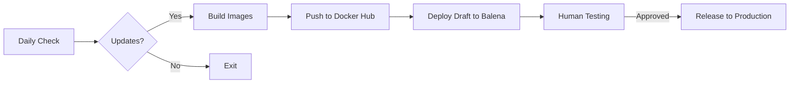

# ColmenaOS


ColmenaOS is an offline-first, solar-powered operating system for community radio and podcasting. Built on BalenaOS, it provides a complete, self-contained platform that works with or without internet connectivity, giving communities full control over their media infrastructure.

## 🌟 Key Features

- **🔌 Offline First**: Fully functional without internet connection
- **☀️ Solar Optimized**: Low power consumption for renewable energy systems
- **📻 Professional Audio**: Built-in recording, editing, and broadcasting tools
- **🔧 Multi-Architecture**: Supports AMD64 PCs and ARM64 devices (Raspberry Pi 4+)
- **🐳 Container-Based**: Modular architecture using Docker containers
- **🚀 Auto-Updates**: Automated CI/CD pipeline with safe rollback capabilities
- **🌐 Community Focused**: Designed for decentralized, sovereign media production
- **🔒 Secure by Default**: Pre-configured security and data sovereignty

## 🏗️ Architecture

ColmenaOS consists of multiple services orchestrated via Docker Compose:

```
┌─────────────────────────────────────────────────────────┐
│                     ColmenaOS Stack                     │
├─────────────────┬────────────┬────────────┬────────────┤
│    Frontend     │   Backend  │ Nextcloud  │  Mailcrab  │
│  (React PWA)    │  (Django)  │  (Files)   │  (Email)   │
├─────────────────┴────────────┴────────────┴────────────┤
│                    PostgreSQL Database                   │
├─────────────────────────────────────────────────────────┤
│                   BalenaOS (Host OS)                    │
└─────────────────────────────────────────────────────────┘
```

## 🚀 Quick Start

### Option 1: Deploy with Balena (Recommended for Production)

1. **Sign up** for [Balena Cloud](https://dashboard.balena-cloud.com/signup)
2. **Create** a new fleet for your device type
3. **Add** this project:
   ```bash
   git clone https://github.com/colmena-project/colmena-os.git
   cd colmena-os
   git submodule update --init --recursive
   balena push <your-fleet-name>
   ```
4. **Download** and flash the OS image to your device
5. **Boot** - ColmenaOS will auto-provision and start

### Option 2: Local Development with Docker Compose

```bash
# Clone with submodules
git clone --recursive https://github.com/colmena-project/colmena-os.git
cd colmena-os

# Copy environment template
cp .env.example .env
# Edit .env with your configuration

# Start services
docker compose up -d

# Access at http://localhost
```

## 📋 Requirements

### Hardware
- **Minimum**: 2GB RAM, 16GB storage, ARM64/AMD64 CPU
- **Recommended**: 4GB RAM, 32GB storage, USB audio interface
- **Supported Devices**: Raspberry Pi 4, Intel NUC, generic x86_64

### Software
- Docker & Docker Compose (for local development)
- Balena CLI (for Balena deployments)
- Git with submodule support

## 🔄 CI/CD Pipeline

Our automated pipeline ensures reliable deployments:



### Automated Workflows
- **Daily builds**: Check for submodule updates and rebuild if needed
- **Draft deployments**: Automatic deployment to test fleet
- **Release process**: Manual approval required for production

## 🛠️ Development

### Project Structure
```
colmena-os/
├── docker-compose.yml      # Service definitions
├── balena.yml             # Balena configuration
├── .github/               # GitHub Actions workflows
│   ├── workflows/         # CI/CD pipelines
│   └── actions/           # Reusable actions
├── backend/               # Django backend (submodule)
├── frontend/              # React frontend (submodule)
├── devops/                # Infrastructure configs (submodule)
└── tests/                 # Testing infrastructure
```

### Working with Submodules
```bash
# Update all submodules
git submodule update --remote --merge

# Work on a specific component
cd frontend
git checkout -b feature/my-feature
# Make changes, commit, push
cd ..
git add frontend
git commit -m "Update frontend submodule"
```

### Testing
```bash
# Create a test environment on DigitalOcean
./tests/do-testbed_cli.sh create

# Run integration tests
./tests/test-balena.sh

# Clean up
./tests/do-testbed_cli.sh destroy
```

## 📚 Documentation

- [Installation Guide](https://docs.colmena.coop/installation/)
- [Configuration Reference](https://docs.colmena.coop/configuration/)
- [API Documentation](https://docs.colmena.coop/api/)
- [Troubleshooting](https://docs.colmena.coop/troubleshooting/)

## 🤝 Contributing

We welcome contributions! Please see [CONTRIBUTING.md](CONTRIBUTING.md) for guidelines.

## 📄 License

MIT License - see [LICENSE](LICENSE) file for details.

## 🙏 Acknowledgments

ColmenaOS is built with support from:
- [Cambá Cooperative](https://camba.coop) - Core platform development
- [Wakoma](https://wakoma.co) - Hardware integration
- [CORAPE](https://corape.org.ec/) - Community testing
- Community contributors worldwide
