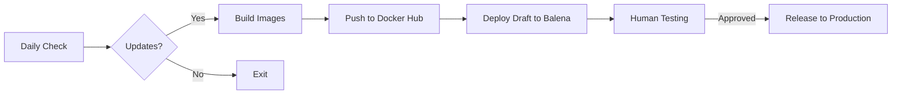

# ColmenaOS


ColmenaOS is an offline-first, solar-powered operating system for community radio and podcasting. Built on BalenaOS, it provides a complete, self-contained platform that works with or without internet connectivity, giving communities full control over their media infrastructure.

## 🌟 Key Features

- **🔌 Offline First**: Fully functional without internet connection
- **☀️ Solar Optimized**: Low power consumption for renewable energy systems
- **📻 Professional Audio**: Built-in recording, editing, and broadcasting tools
- **🔧 Multi-Architecture**: Supports AMD64 PCs and ARM64 devices (Raspberry Pi 4+)
- **🐳 Container-Based**: Modular architecture using Docker containers
- **🚀 Auto-Updates**: Automated CI/CD pipeline with safe rollback capabilities
- **🌐 Community Focused**: Designed for decentralized, sovereign media production
- **🔒 Secure by Default**: Pre-configured security and data sovereignty

## 🏗️ Architecture

ColmenaOS consists of multiple services orchestrated via Docker Compose:

```
┌─────────────────────────────────────────────────────────┐
│                     ColmenaOS Stack                     │
├─────────────────┬────────────┬────────────┬────────────┤
│    Frontend     │   Backend  │ Nextcloud  │  Mailcrab  │
│  (React PWA)    │  (Django)  │  (Files)   │  (Email)   │
├─────────────────┴────────────┴────────────┴────────────┤
│                    PostgreSQL Database                   │
├─────────────────────────────────────────────────────────┤
│                   BalenaOS (Host OS)                    │
└─────────────────────────────────────────────────────────┘
```

## 🚀 Quick Start

### Option 1: Local Development (Recommended for Testing)

```bash
# Clone with submodules
git clone --recursive https://github.com/colmena-project/colmena-os.git
cd colmena-os

# Copy and configure environment
cp .env.example .env
# Edit .env file - replace all CHANGE_ME values with secure passwords

# Start all services
docker compose up -d

# Wait for services to start (about 2-3 minutes)
docker compose logs -f colmena-app  # Watch startup logs
```

**🌐 Access Your Services:**
- **Frontend (Main App)**: http://localhost:8080
- **Backend API**: http://localhost:8000
- **pgAdmin (Database)**: http://localhost:5050
- **Nextcloud (Files)**: http://localhost:8003
- **Mailcrab (Email)**: http://localhost:1080

**📋 Default Login:**
- **Email**: admin@colmena.org
- **Password**: (set in .env as SUPERADMIN_PASSWORD)

### Option 2: Production Deployment with Balena

```bash
# Install Balena CLI
npm install -g balena-cli

# Login and create fleet
balena login
balena fleet create myfleet

# Deploy to fleet
git clone --recursive https://github.com/colmena-project/colmena-os.git
cd colmena-os
balena push myfleet

# Flash device and boot
balena os download raspberrypi4-64 --version latest
balena os configure downloaded-image.img --fleet myfleet
balena local flash downloaded-image.img
```

## 📋 Requirements

### Hardware
- **Minimum**: 2GB RAM, 16GB storage, ARM64/AMD64 CPU
- **Recommended**: 4GB RAM, 32GB storage, USB audio interface
- **Supported Devices**: Raspberry Pi 4, Intel NUC, generic x86_64

### Software
- **Docker & Docker Compose** (for local development)
- **Balena CLI** (for production deployments)
- **Git** with submodule support

### Ports Used
- **8080**: Frontend application (main interface)
- **8000**: Backend API
- **5432**: PostgreSQL database  
- **5050**: pgAdmin web interface
- **8003/8004**: Nextcloud file storage
- **1080/1025**: Mailcrab email testing

## 🔄 CI/CD Pipeline

Our automated pipeline ensures reliable deployments:



### Automated Workflows
- **Daily builds**: Check for submodule updates and rebuild if needed
- **Draft deployments**: Automatic deployment to test fleet
- **Release process**: Manual approval required for production

## 🛠️ Development

### Project Structure
```
colmena-os/
├── docker-compose.yml      # Service definitions
├── balena.yml             # Balena configuration
├── .github/               # GitHub Actions workflows
│   ├── workflows/         # CI/CD pipelines
│   └── actions/           # Reusable actions
├── backend/               # Django backend (submodule)
├── frontend/              # React frontend (submodule)
├── devops/                # Infrastructure configs (submodule)
└── tests/                 # Testing infrastructure
```

### Working with Submodules
```bash
# Update all submodules
git submodule update --remote --merge

# Work on a specific component
cd frontend
git checkout -b feature/my-feature
# Make changes, commit, push
cd ..
git add frontend
git commit -m "Update frontend submodule"
```

### Testing
```bash
# Quick test - rebuild and verify all services
./scripts/clean_and_test.sh

# Reset database if needed
./scripts/reset_postgres.sh

# Run full CI test suite
./scripts/ci-test.sh local
```

### Troubleshooting

**Services not starting?**
```bash
# Check service status
docker compose ps

# View logs
docker compose logs colmena-app
docker compose logs postgres

# Restart services
docker compose restart

# Complete reset
docker compose down --volumes
docker compose up -d
```

**Can't access services?**
- Ensure Docker is running and ports aren't blocked
- Wait 2-3 minutes for full startup
- Check health: `docker compose ps` - all services should show "healthy" or "running"

## 📚 Documentation

- [Installation Guide](https://docs.colmena.coop/installation/)
- [Configuration Reference](https://docs.colmena.coop/configuration/)
- [API Documentation](https://docs.colmena.coop/api/)
- [Troubleshooting](https://docs.colmena.coop/troubleshooting/)

## 🤝 Contributing

We welcome contributions! Please see [CONTRIBUTING.md](CONTRIBUTING.md) for guidelines.

## 📄 License

MIT License - see [LICENSE](LICENSE) file for details.

## 🙏 Acknowledgments

ColmenaOS is built with support from:
- [Cambá Cooperative](https://camba.coop) - Core platform development
- [Wakoma](https://wakoma.co) - Hardware integration
- [CORAPE](https://corape.org.ec/) - Community testing
- Community contributors worldwide
