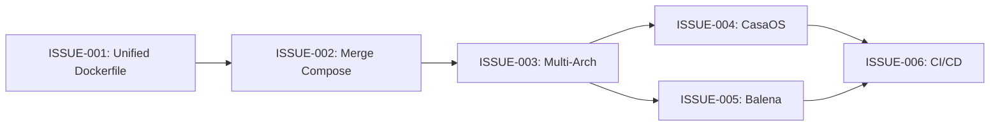

# Issues Roadmap (Simplified)

## 🎯 Main Objective
Create a single, unified docker-compose.yml that combines the ColmenaOS app (frontend + backend) with the devops services, deployable across Docker, CasaOS, and Balena.

---

## 🔴 Phase 1: Unification (Week 1)

### ISSUE-001: Create Unified Dockerfile
**Priority**: Critical  
**Effort**: 2 days  

**Description**: Combine frontend and backend into a single container image.

**Tasks**:
- [ ] Analyze existing `frontend/devops/builder/Dockerfile`
- [ ] Analyze existing `backend/devops/builder/Dockerfile`  
- [ ] Create new `Dockerfile` in root that combines both services
- [ ] Use supervisor or similar to run both processes
- [ ] Test unified image locally

**Context Files**:
- [unified-dockerfile.md](./context/unified-dockerfile.md)
- [existing-dockerfiles-analysis.md](./context/existing-dockerfiles-analysis.md)

---

### ISSUE-002: Merge Docker Compose Files
**Priority**: Critical  
**Effort**: 1 day

**Description**: Combine app services with devops docker-compose.yml into single file.

**Tasks**:
- [ ] Add unified app service to existing docker-compose.yml
- [ ] Configure networking between app and devops services
- [ ] Set proper environment variables
- [ ] Test complete stack locally

**Context Files**:
- [docker-compose-merge.md](./context/docker-compose-merge.md)
- [service-networking.md](./context/service-networking.md)

---

## 🟡 Phase 2: Multi-Architecture (Week 2)

### ISSUE-003: Add Multi-Arch Support
**Priority**: High  
**Effort**: 3 days

**Description**: Enable ARM64/AMD64 builds using Docker buildx.

**Tasks**:
- [ ] Update unified Dockerfile for multi-arch
- [ ] Setup buildx in GitHub Actions
- [ ] Test on Raspberry Pi
- [ ] Push multi-arch image to Docker Hub

**Context Files**:
- [multi-arch-setup.md](./context/multi-arch-setup.md)
- [github-actions-buildx.md](./context/github-actions-buildx.md)

---

## 🟢 Phase 3: Platform Deployment (Week 3)

### ISSUE-004: CasaOS Integration
**Priority**: Medium  
**Effort**: 1 day

**Description**: Ensure docker-compose.yml works with CasaOS.

**Tasks**:
- [ ] Add CasaOS metadata comments to docker-compose.yml
- [ ] Test installation via CasaOS
- [ ] Create icon and app description
- [ ] Submit to CasaOS app store

**Context Files**:
- [casaos-metadata.md](./context/casaos-metadata.md)

---

### ISSUE-005: Balena Configuration  
**Priority**: Medium  
**Effort**: 2 days

**Description**: Ensure deployment works with Balena.

**Tasks**:
- [ ] Verify balena.yml configuration
- [ ] Test deployment to Balena cloud
- [ ] Configure fleet variables
- [ ] Document device onboarding

**Context Files**:
- [balena-setup.md](./context/balena-setup.md)

---

## 🔵 Phase 4: Automation (Week 4)

### ISSUE-006: CI/CD Pipeline
**Priority**: Low  
**Effort**: 2 days

**Description**: Automate builds and deployments.

**Tasks**:
- [ ] Create GitHub Actions workflow for builds
- [ ] Setup automated Docker Hub pushes
- [ ] Add Balena deployment automation
- [ ] Configure GitLab CI migration path

**Context Files**:
- [ci-cd-simple.md](./context/ci-cd-simple.md)

---

## Implementation Order

## Current docker-compose.yml Services

From `colmena-devops`:
- postgres (port 5432)
- pgadmin (port 5050)  
- nextcloud (ports 8003, 8004)
- mail (ports 1080, 1025)

To be added:
- colmena-app (unified frontend+backend, port 8080)

## Key Decisions Made

1. **Single Image**: Instead of separate frontend/backend containers, create one unified container
2. **Reuse Existing**: Leverage existing Dockerfiles from submodules
3. **Simple Compose**: One docker-compose.yml for everything
4. **Platform Agnostic**: Same setup works for Docker, CasaOS, and Balena

---
*Start with ISSUE-001 and work sequentially through the phases.*