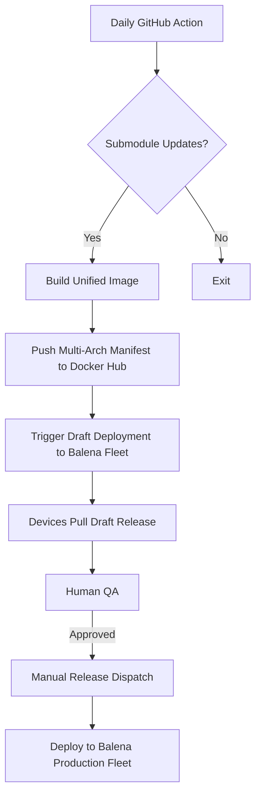

# Release Flow

**Related roadmap items:** ISSUE-003, ISSUE-006  
**Primary objective:** [3 — Reach Multi-Platform Distribution with Automation](../10-objectives.md#3-reach-multi-platform-distribution-with-automation)

## Key Responsibilities
- **Automation:** Handle daily checks, build, and draft deployment.
- **Release Manager:** Validate draft fleet, approve production run.
- **Ops:** Monitor device rollout and rollback if required.

## Rollback Plan
- Retain previous tagged images in Docker Hub.
- Use Balena dashboard to pin devices back to prior release if post-deploy checks fail.

For raw brainstorming diagrams see [`../context/FLOWCHART.md`](../context/FLOWCHART.md).
